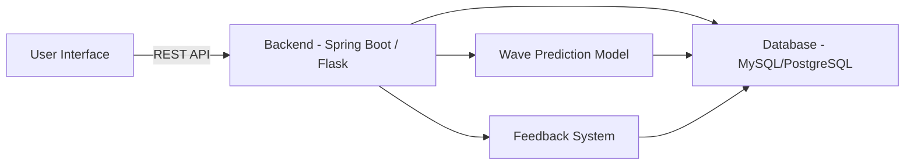

# surf-oracle
Side project to work on that will hopefully predict surf swell in locations making use of current and historical data.

# Surf Prediction Web Application Roadmap

This project aims to develop a surf prediction web application with a machine learning-based swell prediction system, user accounts, saved surf spots, a feedback mechanism, and graphical visualizations of wave data. Below is a roadmap for developing this application in two different technology stacks: **Java with Spring Boot** and **Python with Flask/Django**.

---

## Roadmap Overview

The project will consist of the following key components:

1. **Wave Prediction Model** (for swell prediction)
2. **Backend Server** (API to serve data)
3. **Frontend UI** (web interface)
4. **User Management** (accounts, saved spots, etc.)
5. **Feedback System** (rating predictions)
6. **Graphical Visualizations** (wave visuals, charts, etc.)

---

## Option 1: Java with Spring Boot


Spring Boot provides a robust framework for building scalable, enterprise-level applications. Here’s a breakdown of the steps to develop the surf prediction app using Spring Boot.

### 1. Backend (Spring Boot)

- **Set up Spring Boot**:
  - Use **Spring Initializr** to bootstrap your project with dependencies like Spring Web, Spring Data JPA, and Spring Security.
  - **Maven** or **Gradle** can be used for build automation.
    
- **Modeling Surf Predictions**:
  - Use Java ML libraries like **Weka** or integrate with a Python-based model via **REST APIs**.
    
- **Database Integration**:
  - Use **MySQL** or **PostgreSQL** with **Hibernate ORM** for database interactions and mapping models to tables.
    
- **API Development**:
  - Build RESTful APIs for surf predictions and user-related functionality.
  - Use **Swagger** for API documentation.
    
### 2. User Management (Spring Security)

- Implement user authentication and roles (admin, user) using **Spring Security** with **JWT tokens**.

### 3. Frontend (React/Vue/Angular)

- Create an interactive frontend using a modern JavaScript framework like **React** or **Vue.js**.
- Connect the frontend to the backend via REST APIs.

### 4. Data Visualization

- Use **Chart.js** or **D3.js** to create charts and visualizations.
- For advanced wave simulations, integrate **Three.js** or **WebGL**.

### 5. Feedback and Rating System

- Allow users to rate prediction accuracy. Store this data in the database and use it to improve the prediction model.

### 6. Deployment and CI/CD

- **Docker** can be used for containerization.
- Set up CI/CD using **Jenkins** or **GitHub Actions** and deploy to **AWS**, **Heroku**, or **Google Cloud**.

---

### Java Stack Summary

- **Framework**: Spring Boot
- **Build Tools**: Maven/Gradle
- **Database**: MySQL/PostgreSQL + Hibernate (JPA)
- **Frontend**: React/Angular/Vue (or Thymeleaf for templating)
- **Machine Learning**: Weka or external Python integration
- **Visualization**: Chart.js, D3.js, Three.js
- **Authentication**: Spring Security + JWT
- **CI/CD**: Docker + Jenkins/GitHub Actions
- **Deployment**: AWS/Heroku/Google Cloud

---

## **Option 2: Python with Flask/Django**


Python provides an easier and more flexible approach, particularly if you’re focusing on machine learning. You can use **Flask** for a lightweight option or **Django** if you need a full-featured framework.

### **1. Backend (Flask/Django)**
- **Flask** for flexibility or **Django** for an all-in-one framework with built-in tools for authentication and ORM.
- Use **Pip** and **virtualenv** for dependency and environment management.

- **Wave Prediction Model**:
    - Use Python libraries like **Scikit-learn**, **TensorFlow**, or **PyTorch** for ML models.
    
- **Database Integration**:
    - Use **PostgreSQL** or **MySQL** with **Flask-SQLAlchemy** or **Django ORM** for database interactions.
    
- **API Development**:
    - Build REST APIs using **Flask-RESTful** or **Django REST Framework (DRF)**.
    - Use **Swagger** for API documentation.

### **2. User Management**
- In Django, use the built-in authentication system. In Flask, implement with **Flask-Security** or **Flask-JWT**.

### **3. Frontend (React/Vue/Angular)**
- Build a JavaScript-based frontend with **React** or **Vue**. Connect it to the backend APIs.

### **4. Data Visualization**
- Use **Matplotlib** or **Plotly** for backend-generated visualizations.
- Use **D3.js** or **Chart.js** for real-time graphing on the frontend.

### **5. Feedback and Rating System**
- Allow users to rate predictions and use this data to improve the machine learning model.

### **6. Deployment and CI/CD**
- Use **Docker** for containerization.
- CI/CD pipelines can be set up with **GitHub Actions** or **Travis CI**.
- Deploy on **AWS**, **Heroku**, or **Google Cloud**.

---

### **Python Stack Summary**
- **Framework**: Flask (lightweight) or Django (full-featured)
- **Build Tools**: Pip + virtualenv
- **Database**: MySQL/PostgreSQL + Django ORM/Flask-SQLAlchemy
- **Frontend**: React/Angular/Vue
- **Machine Learning**: Scikit-learn, TensorFlow, or PyTorch
- **Visualization**: Plotly, Matplotlib (backend), D3.js, Chart.js (frontend)
- **Authentication**: Flask-Security/JWT or Django Auth
- **CI/CD**: Docker + GitHub Actions/Travis CI
- **Deployment**: AWS/Heroku/Google Cloud

---

## **Java vs. Python: Pros and Cons**

| Criteria                | Java (Spring Boot)                                          | Python (Flask/Django)                                       |
|-------------------------|------------------------------------------------------------|-------------------------------------------------------------|
| **Ease of Use**          | More complex setup, but robust and scalable                | Easier to get started, better for ML integration             |
| **Machine Learning**     | Harder to integrate directly, requires external services    | Best suited for ML with strong support in Python ecosystem   |
| **Frontend Integration** | Works well with React, Angular, Vue                        | Equally well integrated with modern JS frameworks            |
| **Deployment**           | Docker-friendly, enterprise-level deployment (AWS, GCP)    | Easier deployment with services like Heroku, DigitalOcean    |
| **Performance**          | Higher performance, especially for multi-threaded apps     | Better for lightweight applications and quick iterations     |
| **Community and Support**| Excellent for enterprise support                           | Excellent for startups and data-centric projects             |

---

## **Diagrams**

### **Architecture Overview**
Here’s a simple diagram to illustrate how both stacks (Java and Python) would interact in the application.


```mwemIS
graph TD
  A[Oceanographic Data] -->|Train ML Model| B[Wave Prediction Model]
  B -->|Prediction| C[Backend API]
  C --> D[User Interface]
  D -->|Rating Feedback| E[Backend API]
  E -->|Improve Prediction| B
```
There may be more to come, an Alex and Aaron project.