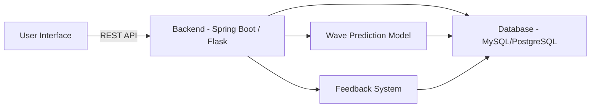
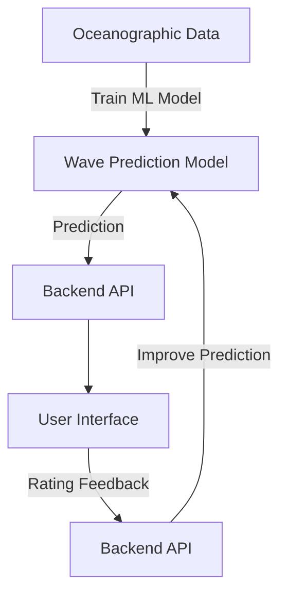

# surf-oracle
Side project to work on that will hopefully predict surf swell in locations making use of current and historical data.

# Surf Prediction Web Application Roadmap

This project aims to develop a surf prediction web application with a machine learning-based swell prediction system, user accounts, saved surf spots, a feedback mechanism, and graphical visualizations of wave data. Below is a roadmap for developing this application in two different technology stacks: **Java with Spring Boot** and **Python with Flask/Django**.

---

## Roadmap Overview

The project will consist of the following key components:

1. **Wave Prediction Model** (for swell prediction)
2. **Backend Server** (API to serve data)
3. **Frontend UI** (web interface)
4. **User Management** (accounts, saved spots, etc.)
5. **Feedback System** (rating predictions)
6. **Graphical Visualizations** (wave visuals, charts, etc.)

---

## Option 1: Java with Spring Boot

    

Spring Boot provides a robust framework for building scalable, enterprise-level applications. Here’s a breakdown of the steps to develop the surf prediction app using Spring Boot.

### 1. Backend (Spring Boot)

- **Set up Spring Boot**:
  - Use **Spring Initializr** to bootstrap your project with dependencies like Spring Web, Spring Data JPA, and Spring Security.
  - **Maven** or **Gradle** can be used for build automation.
    
- **Modeling Surf Predictions**:
  - Use Java ML libraries like **Weka** or integrate with a Python-based model via **REST APIs**.
    
- **Database Integration**:
  - Use **MySQL** or **PostgreSQL** with **Hibernate ORM** for database interactions and mapping models to tables.
    
- **API Development**:
  - Build RESTful APIs for surf predictions and user-related functionality.
  - Use **Swagger** for API documentation.
    
### 2. User Management (Spring Security)

- Implement user authentication and roles (admin, user) using **Spring Security** with **JWT tokens**.

### 3. Frontend (React/Vue/Angular)

- Create an interactive frontend using a modern JavaScript framework like **React** or **Vue.js**.
- Connect the frontend to the backend via REST APIs.

### 4. Data Visualization

- Use **Chart.js** or **D3.js** to create charts and visualizations.
- For advanced wave simulations, integrate **Three.js** or **WebGL**.

### 5. Feedback and Rating System

- Allow users to rate prediction accuracy. Store this data in the database and use it to improve the prediction model.

### 6. Deployment and CI/CD

- **Docker** can be used for containerization.
- Set up CI/CD using **Jenkins** or **GitHub Actions** and deploy to **AWS**, **Heroku**, or **Google Cloud**.

---

### Java Stack Summary

- **Framework**: Spring Boot
- **Build Tools**: Maven/Gradle
- **Database**: MySQL/PostgreSQL + Hibernate (JPA)
- **Frontend**: React/Angular/Vue (or Thymeleaf for templating)
- **Machine Learning**: Weka or external Python integration
- **Visualization**: Chart.js, D3.js, Three.js
- **Authentication**: Spring Security + JWT
- **CI/CD**: Docker + Jenkins/GitHub Actions
- **Deployment**: AWS/Heroku/Google Cloud

---

## **Option 2: Python with Flask/Django**

  
   

Python provides an easier and more flexible approach, particularly if you’re focusing on machine learning. You can use **Flask** for a lightweight option or **Django** if you need a full-featured framework.

### **1. Backend (Flask/Django)**
- **Flask** for flexibility or **Django** for an all-in-one framework with built-in tools for authentication and ORM.
- Use **Pip** and **virtualenv** for dependency and environment management.

- **Wave Prediction Model**:
    - Use Python libraries like **Scikit-learn**, **TensorFlow**, or **PyTorch** for ML models.
    
- **Database Integration**:
    - Use **PostgreSQL** or **MySQL** with **Flask-SQLAlchemy** or **Django ORM** for database interactions.
    
- **API Development**:
    - Build REST APIs using **Flask-RESTful** or **Django REST Framework (DRF)**.
    - Use **Swagger** for API documentation.

### **2. User Management**
- In Django, use the built-in authentication system. In Flask, implement with **Flask-Security** or **Flask-JWT**.

### **3. Frontend (React/Vue/Angular)**
- Build a JavaScript-based frontend with **React** or **Vue**. Connect it to the backend APIs.

### **4. Data Visualization**
- Use **Matplotlib** or **Plotly** for backend-generated visualizations.
- Use **D3.js** or **Chart.js** for real-time graphing on the frontend.

### **5. Feedback and Rating System**
- Allow users to rate predictions and use this data to improve the machine learning model.

### **6. Deployment and CI/CD**
- Use **Docker** for containerization.
- CI/CD pipelines can be set up with **GitHub Actions** or **Travis CI**.
- Deploy on **AWS**, **Heroku**, or **Google Cloud**.

---

### **Python Stack Summary**
- **Framework**: Flask (lightweight) or Django (full-featured)
- **Build Tools**: Pip + virtualenv
- **Database**: MySQL/PostgreSQL + Django ORM/Flask-SQLAlchemy
- **Frontend**: React/Angular/Vue
- **Machine Learning**: Scikit-learn, TensorFlow, or PyTorch
- **Visualization**: Plotly, Matplotlib (backend), D3.js, Chart.js (frontend)
- **Authentication**: Flask-Security/JWT or Django Auth
- **CI/CD**: Docker + GitHub Actions/Travis CI
- **Deployment**: AWS/Heroku/Google Cloud

---

## **Java vs. Python: Pros and Cons**

| Criteria                | Java (Spring Boot)                                          | Python (Flask/Django)                                       |
|-------------------------|------------------------------------------------------------|-------------------------------------------------------------|
| **Ease of Use**          | More complex setup, but robust and scalable                | Easier to get started, better for ML integration             |
| **Machine Learning**     | Harder to integrate directly, requires external services    | Best suited for ML with strong support in Python ecosystem   |
| **Frontend Integration** | Works well with React, Angular, Vue                        | Equally well integrated with modern JS frameworks            |
| **Deployment**           | Docker-friendly, enterprise-level deployment (AWS, GCP)    | Easier deployment with services like Heroku, DigitalOcean    |
| **Performance**          | Higher performance, especially for multi-threaded apps     | Better for lightweight applications and quick iterations     |
| **Community and Support**| Excellent for enterprise support                           | Excellent for startups and data-centric projects             |

---

## **Diagrams**

### **Architecture Overview**
Here’s a simple diagram to illustrate how both stacks (Java and Python) would interact in the application.

# **Surf Prediction Web Application**

This project aims to develop a surf prediction web application that utilizes historical and current data on weather, waves, and tides to provide reliable surf predictions. This approach focuses on statistical methods rather than complex AI algorithms initially, allowing for a quicker development cycle.

---

## **Wave Prediction Model without AI**

### **1. Data Sources**
To build the wave prediction model, gather relevant data from various sources:

- **Historical Wave Data**: Obtain past wave heights, periods, and directions from sources like NOAA (National Oceanic and Atmospheric Administration) and various surf forecasting websites.
  
- **Current Weather Data**: Access real-time weather data, including wind speed, wind direction, atmospheric pressure, and temperature. APIs like OpenWeatherMap or WeatherAPI are useful for this purpose.

- **Tide Data**: Gather historical and current tidal information from tide prediction services or government oceanographic agencies.

### **2. Data Integration**
Combine these data sets into a cohesive model:

- **Data Storage**: Store historical data in a database (e.g., PostgreSQL or MySQL). Use Python with Flask or Django to manage data collection and storage.

- **APIs for Current Data**: Set up scripts to fetch current data from the weather and tide APIs at regular intervals (e.g., hourly). Use libraries like `requests` in Python to pull this data and update your database.

### **3. Prediction Logic**
Create a basic prediction algorithm using statistical methods:

- **Statistical Analysis**: Employ statistical techniques like regression analysis to identify relationships between historical weather conditions and wave patterns. For example:
  - **Linear Regression**: Predict wave height based on wind speed, direction, and tide level.
  - **Moving Averages**: Calculate moving averages to smooth fluctuations and help predict future conditions based on historical data.

- **Rule-Based System**: Implement a simple rule-based system with thresholds (e.g., “If wind speed exceeds 20 mph and is onshore, expect larger waves.”) for straightforward predictions.

### **4. Visualizations**
Create visualizations to represent your predictions:

- **Graphs and Charts**: Use libraries like Matplotlib or Plotly to generate graphs showing predicted vs. actual wave heights, wind speeds, and tide levels over time.

- **User Interface**: Present this data on your web app, allowing users to see predictions, historical data, and correlations.

### **5. Iterative Improvement**
As you gather more data and user feedback, consider gradually implementing more sophisticated methods, including:

- **Machine Learning**: Once you have sufficient data, transition to machine learning models to improve accuracy and account for more complex patterns.

- **User Feedback Loop**: Create a feedback system for users to rate predictions, helping to improve the algorithm based on real-world outcomes.

---

## **Advantages of This Approach**
- **Lower Complexity**: Focusing on historical and current data allows for a solid foundation without the complexity of AI.
- **Easier Debugging**: Straightforward statistical methods make it easier to troubleshoot and refine predictions.
- **Quick MVP**: Develop a Minimum Viabl

## **Roadmap Overview**

### **Step 2: Backend Server (API Development)**

The backend server is essential for handling requests, managing data, and providing the necessary APIs for the frontend to communicate with. Here’s how to set it up:

#### **2.1 Choose the Framework**
- **Java (Spring Boot)**:
  - Use **Spring Boot** for creating a RESTful API quickly.
  - Benefits include dependency management with **Maven** and built-in features for handling security and data access.

- **Python (Flask/Django)**:
  - Choose **Flask** for lightweight applications or **Django** for a more robust, full-featured framework.
  - Both frameworks facilitate the creation of REST APIs and make data handling straightforward.

#### **2.2 Set Up Database**
- Use a relational database like **PostgreSQL** or **MySQL** for storing user data, predictions, historical data, etc.
- Use **ORM** (Object Relational Mapping) tools:
  - **Java**: Use **Spring Data JPA** to interact with the database.
  - **Python**: Use **SQLAlchemy** (with Flask) or **Django ORM** for managing database operations.

#### **2.3 Develop REST APIs**
- Define endpoints for the frontend to interact with:
  - **User Management**: Endpoints for user registration, login, and profile management.
  - **Wave Predictions**: Endpoints for fetching historical and predicted wave data.
  - **Feedback System**: Endpoints for submitting and retrieving user feedback on predictions.

#### **2.4 Implement Authentication**
- Use JWT (JSON Web Tokens) for user authentication:
  - **Java**: Use **Spring Security** with JWT support.
  - **Python**: Use **Flask-JWT** or **Django Rest Framework** with built-in token authentication.
  
#### **2.5 Testing**
- Write unit tests for your APIs to ensure functionality:
  - Use testing frameworks such as **JUnit** for Java and **pytest** or **unittest** for Python.

---

### **Step 3: Frontend UI Development**

The frontend UI is crucial for providing users with an interactive experience to view predictions and manage their accounts. Here’s how to develop it:

#### **3.1 Choose a Frontend Framework**
- **React**: A popular library for building user interfaces. Great for single-page applications (SPAs).
- **Vue**: An approachable, versatile framework for building user interfaces.
- **Angular**: A platform for building mobile and desktop web applications with a robust structure.

#### **3.2 Design the User Interface**
- Focus on a user-friendly layout with the following components:
  - **Home Page**: Display current conditions, wave predictions, and trending surf spots.
  - **User Dashboard**: Allow users to view their saved spots and prediction history.
  - **Feedback Page**: Enable users to submit feedback and view ratings of past predictions.

#### **3.3 Connect to the Backend**
- Use **Axios** or **Fetch API** to connect the frontend to the backend APIs:
  - Fetch wave predictions and display them in a visual format (graphs/charts).
  - Handle user authentication (login/logout) and manage session states.

#### **3.4 Data Visualization**
- Use libraries such as **Chart.js**, **D3.js**, or **Plotly** for graphical visualizations of wave data:
  - Create interactive charts that represent historical vs. predicted wave heights, wind speeds, and tide levels.

#### **3.5 Testing**
- Write tests for your components:
  - Use testing libraries like **Jest** and **React Testing Library** for React, or **Mocha** and **Chai** for Vue/Angular.

---

### **Step 4: User Management**

User management is a critical component of the surf prediction web application. It enables users to create accounts, save their favorite surf spots, and manage their preferences. Here's how to implement this functionality:

#### **4.1 User Registration and Authentication**
- **Registration**:
  - Create a registration form where users can sign up with their email, username, and password.
  - Implement form validation to ensure the data entered is correct and secure.
  
- **Login**:
  - Provide a login form for users to authenticate themselves.
  - Use JWT (JSON Web Tokens) for maintaining user sessions.

#### **4.2 User Profile Management**
- Allow users to view and edit their profiles:
  - Users should be able to update their email, password, and personal information.
  
- **Saved Spots**:
  - Create functionality for users to save their favorite surf spots.
  - Store this information in the database and link it to their user profile.

#### **4.3 Role Management (Optional)**
- Implement different user roles (e.g., admin, regular user) to manage access to certain features.
- Admin users can moderate content, manage feedback, and view analytics.

#### **4.4 Security Measures**
- Ensure password security by hashing passwords before storing them in the database (e.g., using **BCrypt**).
- Implement rate limiting and account lockout mechanisms to prevent brute-force attacks.

#### **4.5 Testing**
- Write unit tests for user registration, login, and profile management functionality to ensure they work as expected.
---

### **Step 5: Graphical Visualization**

Graphical visualization is essential for presenting wave data, predictions, and user feedback in an intuitive and accessible manner. Here’s how to implement it:

#### **5.1 Choose Visualization Libraries**
- **Frontend Libraries**:
  - Use **Chart.js** or **D3.js** for interactive and customizable charts and graphs.
  - Consider **Plotly** for more advanced visualizations and easy integration with Python data.

#### **5.2 Design Visualizations**
- Identify key data points to visualize:
  - **Wave Predictions**: Show predicted wave heights and periods over time.
  - **Historical Data**: Compare historical wave data against predictions to evaluate accuracy.
  - **User Feedback**: Visualize user ratings and comments over time.

#### **5.3 Implement Interactive Features**
- Allow users to interact with the visualizations:
  - Provide tooltips with detailed information on hover.
  - Enable filtering by date range or specific surf spots to customize the view.

#### **5.4 Integrate with Backend**
- Fetch data from the backend APIs to populate visualizations:
  - Use **Axios** or **Fetch API** to retrieve data from your RESTful API.
  - Update visualizations dynamically as new data is received.

#### **5.5 Responsive Design**
- Ensure that visualizations are responsive and work well on various devices (desktop, tablet, mobile).
- Use CSS frameworks like **Bootstrap** or **Tailwind CSS** to facilitate responsive design.

#### **5.6 Testing**
- Write tests for visualizations to ensure they render correctly and handle edge cases (e.g., no data scenarios).

---

### **Step 6: Feedback System**

A feedback system allows users to rate predictions and provide comments, which can be valuable for improving the prediction model over time. Here’s how to implement this system:

#### **6.1 Feedback Submission**
- Create a feedback form where users can submit their ratings (e.g., 1 to 5 stars) and comments on wave predictions.
- Ensure the form is intuitive and easy to use, prompting users for specific feedback.

#### **6.2 Store Feedback Data**
- Design a database schema to store user feedback:
  - Include fields for user ID, prediction ID, rating, and comments.
  
- Connect this feedback data to the user’s profile for tracking and analysis.

#### **6.3 Feedback Analytics**
- Create an analytics dashboard to visualize feedback trends:
  - Show average ratings, feedback over time, and other metrics that help identify areas for improvement.
  
- Use this data to adjust prediction models, improving accuracy based on user insights.

#### **6.4 User Notifications**
- Consider implementing a notification system to inform users when their feedback leads to changes or improvements in predictions.

#### **6.5 Testing**
- Write tests to verify that feedback submission, storage, and retrieval processes work correctly and efficiently.

---

## **Conclusion**
This roadmap provides a detailed guide for implementing key features of the surf prediction web application, including the backend server, frontend UI, user management, and feedback system. By following these steps, you will create a robust application that meets user needs and evolves over time.

There may be more to come, an Alex and Aaron project.